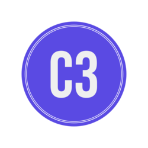

# C3


<!-- PROJECT LOGO -->
<br />
<p align="center">
  <a href="https://github.com/IngegneriaSoftware/C3">
    
  </a>

  <h3 align="center">Centro commerciale in centro</h3>

  <p align="center">
    Ingegneria del software anno 2020/21
    <br />
   Authors: Niccolò Francioni- Eduardo Romero- Marco Antonini
  </p>
</p>


<!-- TABLE OF CONTENTS -->
<details open="open">
  <summary>Table of Contents</summary>
  <ol>
    <li>
      <a href="#about-the-project">About The Project</a>
      <ul>
        <li><a href="#built-with">Built With</a></li>
      </ul>
    </li>
    <li>
      <a href="#getting-started">Getting Started</a>
      <ul>
        <li><a href="#prerequisites">Prerequisites</a></li>
        <li><a href="#installation">Installation</a></li>
      </ul>
    </li>
    <li><a href="#usage">Usage</a></li>
  </ol>
</details>


<!-- ABOUT THE PROJECT -->
## About The Project

<!--[![Product Name Screen Shot][product-screenshot]](https://example.com)-->

Progetto realizzato per l'esame di Ingegneria del Software dell'anno 2020/21

Il progetto si rivolge ai centri abitati medi della provincia italiana dove le attività commerciali del centro soffrono la concorrenza di grossi centri commerciali situati nelle periferie.
L’idea di fondo è considerare il trasporto della merce una volta acquistata una delle scomodità principali degli acquisti in centro oltre alla più difficile collocazione dei punti vendita in relazione a specifiche categorie merceologiche.
Il progetto si pone dunque come obiettivo quello di fornire un supporto per rendere l’esperienza degli acquisti in centro più facile e interessante.
Si identificano in particolare i seguenti chiari attori con alcuni possibili scenari di utilizzo della piattaforma:

* Commerciante: vende la merce e definisce il punto di ritiro della stessa comunicando contestualmente al cliente la merce acquistata e i codici per il ritiro della stessa. Si registra sulla piattaforma e effettua i pagamenti e la gestione del suo account. Può avere delle statistiche sul numero di persone che sono in questo momento nell’area. Può lanciare vendite promozionali sui prodotti. Può consorziarsi con altri punti vendita per definire vendite combinate...
In sostanza può usare la piattaforma per promuovere la propria attività al fine di poter vendere la sua merce

* Cliente: ritira la merce dai punti di prelievo. Può ricercare i punti vendita sulla base di specifiche categorie merceologiche. vuole essere allertato e magari filtrare le promozioni. Riceve alert se il sistema riconosce uno spostamento verso

* Corriere: si registra sulla piattaforma e si rende disponibile a effettuare trasporto della merce. Preleva la merce dai punti vendita. Rilascia la merce presso i punti di prelievo (che ne caso per i residenti in centro può essere la propria abitazione).


### Built With

Main frameworks:
* [Vaadin](https://vaadin.com)
* [Spring Boot](https://spring.io/projects/spring-boot)


<!-- GETTING STARTED -->
## Getting Started

Setting up the project locally:

### Prerequisites

* npm
  ```sh
  npm install npm@latest -g
  ```

### Installation

1. Clone the repo
   ```sh
   git clone https://github.com/IngegneriaSoftware/C3.git
   ```
3. Install NPM packages
   ```sh
   npm install
   ```


<!-- USAGE EXAMPLES -->
## Usage

Start the project with gradle command:
   ```sh
   gradle bootRun
   ```
Enter the application from browser:
   ```sh
   http://localhost:8080/
   ```
To Log-In in the application use one of these users:
   ```sh
   Username:Mario Rossi Password:password Role:COMMERCIANTE
   Username:Luigino Bianchi Password:password Role:CLIENTE
   Username:Luca Verdi Password:password Role:CORRIERE
   ```


<!-- MARKDOWN LINKS & IMAGES -->
<!-- https://www.markdownguide.org/basic-syntax/#reference-style-links -->
[contributors-shield]: https://img.shields.io/github/contributors/othneildrew/Best-README-Template.svg?style=for-the-badge
[contributors-url]: https://github.com/othneildrew/Best-README-Template/graphs/contributors
[forks-shield]: https://img.shields.io/github/forks/othneildrew/Best-README-Template.svg?style=for-the-badge
[forks-url]: https://github.com/othneildrew/Best-README-Template/network/members
[stars-shield]: https://img.shields.io/github/stars/othneildrew/Best-README-Template.svg?style=for-the-badge
[stars-url]: https://github.com/othneildrew/Best-README-Template/stargazers
[issues-shield]: https://img.shields.io/github/issues/othneildrew/Best-README-Template.svg?style=for-the-badge
[issues-url]: https://github.com/othneildrew/Best-README-Template/issues
[license-shield]: https://img.shields.io/github/license/othneildrew/Best-README-Template.svg?style=for-the-badge
[license-url]: https://github.com/othneildrew/Best-README-Template/blob/master/LICENSE.txt
[linkedin-shield]: https://img.shields.io/badge/-LinkedIn-black.svg?style=for-the-badge&logo=linkedin&colorB=555
[linkedin-url]: https://linkedin.com/in/othneildrew
[product-screenshot]: images/screenshot.png

